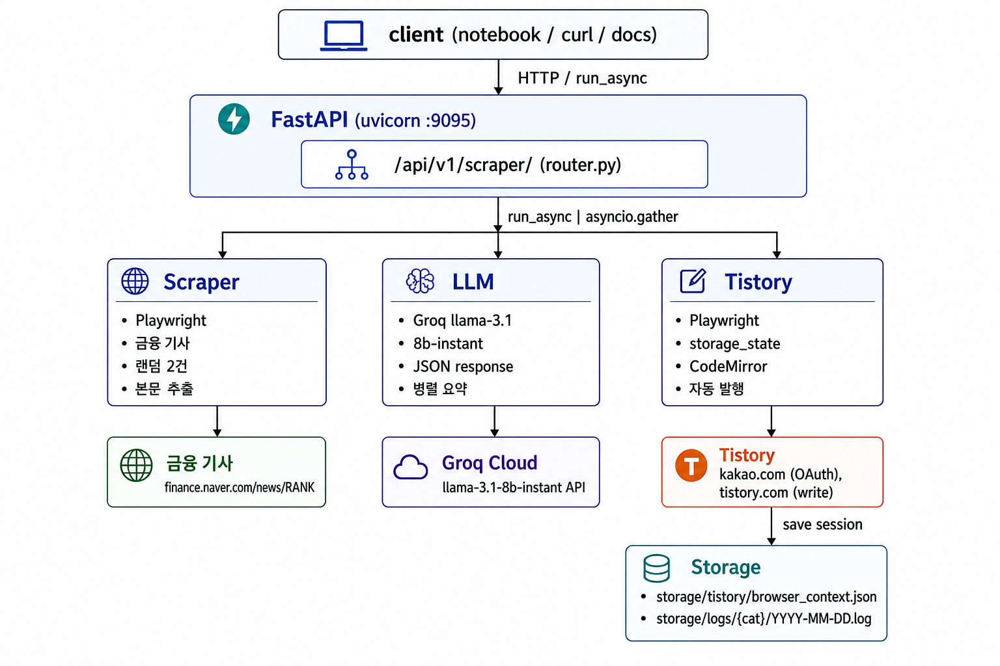

# 티스토리 자동 포스팅 API

FastAPI 기반 금융 뉴스 큐레이션 자동 포스팅 서비스. 네이버 금융에서 랭킹 뉴스를 스크래핑하고, LLM 을 활용하여 블로그 콘텐츠로 가공한 뒤 Playwright로 티스토리 블로그에 자동 발행합니다.

> 카카오 OAuth 로그인 세션을 파일로 보존하고, 매 실행마다 랜덤 픽으로 선정된 뉴스 기사 본문을 LLM(`llama-3.1-8b-instant`)으로 마크다운 블로그 포스트(제목·본문·태그)로 요약합니다. 작성된 글은 티스토리 마크다운 에디터(CodeMirror)에 자동 입력 후 발행됩니다.

---

## 목차

1. [핵심 특징](#핵심-특징)
2. [아키텍처](#아키텍처)
3. [기술 스택](#기술-스택)
4. [프로젝트 구조](#프로젝트-구조)
5. [API 명세](#api-명세)
6. [도메인 상세](#도메인-상세)
7. [노트북 사용](#노트북-사용)
8. [로깅](#로깅)
9. [남은 제한 사항 & 다음 단계](#남은-제한-사항--다음-단계)

---

## 핵심 특징

| 영역 | 내용 |
|---|---|
| **뉴스 스크래핑** | Playwright로 네이버 금융 "많이 본 뉴스" 페이지에서 랜덤 2건 선정. 새 탭에서 본문 추출 후 닫기 |
| **LLM 요약** | `llama-3.1-8b-instant` 모델로 기사 본문 → JSON(`title`, `content`, `tags`) 변환. `response_format={"type": "json_object"}` 로 안정성 확보 |
| **마크다운 콘텐츠 생성** | 시스템 프롬프트로 25~32자 제목 + 800~1200자 마크다운 본문 + `||` 구분 태그 5개 강제 |
| **티스토리 자동 로그인** | 카카오 OAuth를 통한 첫 로그인 후 브라우저 컨텍스트 세션(`storage_state`)을 파일로 저장 → 이후 실행은 자동 |
| **마크다운 모드 자동 전환** | 티스토리 에디터의 기본 모드 → 마크다운 모드 변경 confirm 자동 처리. CodeMirror JS API(`setValue` + change 이벤트 디스패치)로 본문 즉시 입력 |
| **다이얼로그 자동 분기 처리** | "임시 글 복원" / "모드 전환" 같은 confirm을 메시지 기반으로 자동 dismiss/accept |
| **노트북 친화 비동기** | Windows + Jupyter 환경에서 Playwright(`ProactorEventLoop` 요구)를 별도 백그라운드 루프로 실행시키는 `run_async` 헬퍼 제공 |
| **버전 라우팅** | `app/api/`에서 라우터를 `pkgutil`로 자동 수집해 `/api/v1/...`로 등록 |
| **전역 logger + 파일 로그** | `app/core/logger.py`의 단일 logger와 `app/core/utils/log.py`의 일자별 카테고리 파일 로깅 분리 |

---

## 아키텍처


---

### 자동 포스팅 파이프라인

```
[Client/Notebook]   [FastAPI]   [Scraper]    [LLM]       [Tistory]
       │                │           │           │             │
       │ POST /scraper/ │           │           │             │
       ├───────────────►│           │           │             │
       │                │           │           │             │
       │                │ scrape()  │           │             │
       │                ├──────────►│           │             │
       │                │           │           │             │
       │                │ articles  │           │             │
       │                │◄──────────┤           │             │
       │                │                       │             │
       │                │ summarize_many()      │             │
       │                ├──────────────────────►│             │
       │                │                       │             │
       │                │ summarized            │             │
       │                │◄──────────────────────┤             │
       │                │                                     │
       │                │ do_posting()                        │
       │                ├────────────────────────────────────►│
       │                │            Playwright               │
       │                │            ├─ storage_state 로드    │
       │                │            ├─ 새 탭(글쓰기) 열기    │
       │                │            └─ 공개 발행 클릭        │
       │                │                                     │
       │ { DONE }       │                                     │
       │◄───────────────┤
```

---

### Tistory 글쓰기 자동화 (Playwright)

```
[글쓰기 페이지 진입]
       │
       ├─ dialog: "이어서 작성하시겠습니까?"
       │  → dismiss (새 글로 시작)
       │
[마크다운 모드 전환]
       │
       ├─ #editor-mode-layer-btn-open 클릭
       ├─ #editor-mode-markdown-text 클릭
       │
       ├─ dialog: "작성 모드를 변경하시겠습니까?"
       │  → accept (전환 진행)
       │
[본문 입력 — CodeMirror]
       │
       ├─ #post-title-inp 에 title fill
       │
       ├─ document.querySelector('.CodeMirror.cm-s-tistory-markdown')
       │  → editor.setValue(content)
       │  → editor.save()             // textarea 동기화
       │  → input/change 이벤트 dispatch
       │
       ├─ keyboard.type(' ') + Backspace
       │  → 사용자 입력 트리거 (티스토리 변경 감지용)
       │
[태그 + 발행]
       │
       ├─ input[name="tagText"] 에 각 태그 fill + Enter
       ├─ "완료" 클릭
       └─ "공개 발행" 클릭
```

---

## 기술 스택

### Runtime
- **Python** 3.12+
- **FastAPI** 0.133.1
- **Uvicorn[standard]** 0.41.0 (uvloop, httptools, watchfiles)
- **Pydantic** 2.12.5 / **pydantic-settings** 2.13.1
- **python-multipart** (multipart/form-data)

### 브라우저 자동화
- **Playwright** 1.58.0 (chromium, headless 옵션 지원)

### LLM
- 모델: `llama-3.1-8b-instant` (빠른 응답)

### 데이터베이스 / 큐
- **MySQL** 8.0 (SQLAlchemy 2.0.47 + aiomysql 0.3.2 + alembic 1.18.4)
- **MongoDB** (motor)
- **Redis** 7.4.0 (작업 큐 broker/result 예정)

### Auth / HTTP
- **python-jose[cryptography]** (JWT)
- **httpx** (외부 API 호출)

### Dev / 노트북
- **Jupyter Notebook** 7.5.5 + **ipywidgets** 8.1.8
- **pytest** 9.0.2 + **pytest-asyncio** 1.3.0
- **uv** (`uv.lock` 기반 재현 가능한 설치)

---

## 프로젝트 구조

```text
fastapi-tistory/
├── app/
│   ├── api/
│   │   ├── __init__.py                     # /api 루트 + pkgutil 자동 수집
│   │   └── v1/
│   │       ├── __init__.py                 # /v1 + 하위 라우터 자동 등록
│   │       └── tistory/
│   │           ├── __init__.py
│   │           └── router.py               # /api/v1/scraper/...
│   ├── core/
│   │   ├── config.py                       # pydantic-settings, BASE_DIR, STORAGE_PATH, TISTORY_STORAGE
│   │   ├── logger.py                       # 전역 logger + setup_logging
│   │   ├── dependencies/
│   │   │   └── tistory.py
│   │   ├── exceptions/
│   │   │   ├── custom.py                   # 비즈니스 예외
│   │   │   └── handlers.py                 # 글로벌 예외 핸들러 등록
│   │   └── utils/
│   │       ├── error.py                    # exception_format
│   │       ├── file.py                     # ensure_directory
│   │       ├── log.py                      # save_log (일자별 파일 로그)
│   │       ├── notebook.py                 # run_async (백그라운드 Proactor 루프)
│   │       └── response.py                 # 성공/오류 응답 헬퍼
│   ├── modules/
│   │   ├── browser/
│   │   │   └── playwright.py               # PlaywrightManager (start/close/create_context)
│   │   └── llm/
│   │       ├── groq.py                     # create_async_groq_client
│   │       └── prompt.py                   # FINANCE_NEWS_SYSTEM_PROMPT
│   ├── schemas/
│   │   └── common.py                       # BaseResponse 제네릭
│   ├── services/
│   │   ├── scraper/
│   │   │   └── finance_news.py             # FinanceNewsScrapService
│   │   ├── llm/
│   │   │   └── news_summarize.py           # NewsSummarizeService (summarize_one/many)
│   │   └── tistory/
│   │       ├── login.py                    # TistoryLoginService (카카오 OAuth → storage_state 저장)
│   │       ├── post.py
│   │       └── news_post.py                # TistoryPostService (글쓰기/발행 전체)
│   └── main.py                             # FastAPI 진입점
├── config/
│   └── llm.py                              # LLMConfig (모델별 파라미터)
├── notebooks/
│   ├── test.ipynb
│   └── tistory/
│       ├── login.ipynb                     # 최초 카카오 로그인 → 세션 저장
│       ├── post.ipynb
│       └── news_post.ipynb                 # 전체 자동화 파이프라인
├── storage/
│   ├── tistory/
│   │   └── browser_context.json            # 카카오/티스토리 로그인 세션
│   └── logs/                               # save_log 가 쓰는 카테고리별 일자 로그
│       └── tistory/
│           └── 2026-06-04.log
├── tests/
│   └── test_sample.py
├── docs/
├── docker-compose.yml
├── pyproject.toml
├── uv.lock
└── README.md
```

---

## API 명세

모든 엔드포인트는 `/api/v1/` 프리픽스 아래에 있습니다.

### 공통 응답 포맷

성공 응답은 `success_response` 헬퍼로 다음 엔벨로프로 감쌉니다 (`code` 는 문자열):

```json
{
  "code": "200",
  "data": { /* 엔드포인트별 데이터 */ }
}
```

### 엔드포인트 목록

| Method | Path | 설명 | 요청 바디 |
|---|---|---|---|
| `GET` | `/api/v1/tistory/` | 헬스체크 | — |
| `GET` | `/api/v1/tistory/scrap/finance` | 네이버 금융 랭킹 뉴스 스크래핑 | — |
| `POST` | `/api/v1/tistory/summarize/finance` | 스크랩된 기사들을 LLM으로 요약 | `FinanceSummarizeRequest` |
| `POST` | `/api/v1/tistory/publish/finance` | 요약 결과를 티스토리에 발행 | `FinancePublishRequest` |
| `POST` | `/api/v1/tistory/run` | 스크래핑 → 요약 → 발행 전체 파이프라인 (예정) | — |

> 파이프라인은 보통 **scrap → summarize → publish** 순으로 호출합니다. `run` 은 이 3단계를 한 번에 묶는 엔드포인트입니다.

---

#### `GET /api/v1/tistory/scrap/finance`

지정한 뉴스 기사의 랜덤으로 본문을 스크래핑합니다.

**응답** (200):
```json
{
  "code": "200",
  "data": {
    "articles": [
      { "article": "기사 본문 텍스트..." },
      { "article": "기사 본문 텍스트..." }
    ]
  }
}
```

---

#### `POST /api/v1/tistory/summarize/finance`

스크랩한 기사들을 LLM으로 요약해 제목·본문(마크다운)·태그로 가공합니다.

**요청** (`FinanceSummarizeRequest`):
```json
{
  "articles": [
    { "article": "기사 본문 텍스트..." },
    { "article": "기사 본문 텍스트..." }
  ]
}
```

**응답** (200):
```json
{
  "code": "200",
  "data": {
    "summarized_articles": [
      {
        "title": "30자 이내 제목",
        "content": "## 소제목\n\n마크다운 본문...",
        "tags": "삼성전자||반도체||AI||코스피||ETF"
      }
    ]
  }
}
```

---

#### `POST /api/v1/tistory/publish/finance`

요약 결과를 티스토리 블로그에 발행합니다. `reservation_data` 로 예약 발행을 지정할 수 있습니다.

**요청** (`FinancePublishRequest`):
```json
{
  "summarized_articles": [
    {
      "title": "30자 이내 제목",
      "content": "## 소제목\n\n마크다운 본문...",
      "tags": "삼성전자||반도체||AI||코스피||ETF"
    }
  ],
  "reservation_data": {
    "type": "fix",
    "date": "2026-06-15",
    "time": "09:45"
  }
}
```

필드 설명:

| 필드 | 타입 | 설명 |
|---|---|---|
| `summarized_articles` | `SummarizedArticle[]` | 발행할 글 목록 (`title`, `content`, `tags`) |
| `reservation_data` | `object \| null` | 예약 정보. `null` 이면 **즉시(현재) 발행** |
| `reservation_data.type` | `"fix" \| "random"` | 예약 방식 (고정 / 랜덤) |
| `reservation_data.date` | `string` (`YYYY-MM-DD`) | 예약 날짜. **오늘 이전이면 422** (`model_validator` 검증) |
| `reservation_data.time` | `string \| null` | 예약 시각 (`HH:MM`) |

**응답** (200):
```json
{
  "code": "200",
  "data": {
    "posted": 1
  }
}
```

---

### 에러 응답

비즈니스 예외(`BusinessException`)는 전역 핸들러가 다음 포맷으로 반환합니다:

```json
{
  "code": "400",
  "message": "예약 날짜가 오늘보다 이전입니다",
  "errors": []
}
```

| 상황 | 코드 |
|---|---|
| 요청 바디 검증 실패 (필드 누락/타입 불일치/과거 예약일 등) | `422` |
| 비즈니스 규칙 위반 (`BusinessException`) | `400` |
| 티스토리 로그인 세션 만료 (`TistorySessionExpiredException`) | `401` |
| Playwright timeout, LLM JSON 위반 등 내부 오류 | `500` |

---

## 도메인 상세

### 1) 뉴스 스크래핑 (`FinanceNewsScrapService`)

대상: `https://finance.naver.com/news/news_list.naver?mode=RANK`

흐름:
1. Playwright로 페이지 열기 (`headless=False` 기본)
2. `div.hotNewsList ul.simpleNewsList > li` 셀렉터로 뉴스 리스트 수집
3. `random.sample(..., k=2)` 로 무작위 2건 선정
4. 각 항목 클릭 → 새 탭 열림 → 본문(`article#dic_area`) 추출 → 탭 닫기

반환 형태:
```python
[{'article': '본문 텍스트...'}, {'article': '...'}]
```

### 2) LLM 요약 (`NewsSummarizeService`)

`summarize_many`는 `asyncio.gather`로 여러 기사를 병렬 처리.

각 기사는 `summarize_one` 에서:
1. LLM 요청 (시스템 프롬프트 + 기사 본문 전송)
2. `response_format={"type": "json_object"}` 로 JSON 강제
3. 응답 파싱 후 제목 후처리 (줄바꿈 제거, 32자 초과 시 잘라냄)

응답 형식:
```json
{
  "title": "30자 이내 제목",
  "content": "## 소제목\n\n마크다운 본문 800~1200자\n...",
  "tags": "삼성전자||반도체||AI||코스피||ETF"
}
```

프롬프트는 `app/modules/llm/prompt.py` 의 `FINANCE_NEWS_SYSTEM_PROMPT` 참고:
- 제목 32자 초과 금지
- 본문 내 큰따옴표 사용 금지 (JSON escape 깨짐 방지)
- 일본어·중국어 문자 금지
- SEO 키워드 3~5회 자연스러운 반복
- 태그 `||` 구분 5개 이내

### 3) 티스토리 자동 포스팅 (`TistoryPostService`)

핵심 동작:

- **로그인 우회**: `storage/tistory/browser_context.json` 을 `storage_state` 로 로드해 카카오 OAuth 단계 자동 우회
- **다이얼로그 자동 처리**: `_handle_dialog` 가 메시지 내용 보고 분기
  - `"이어서 작성"` → `dismiss()` (새 글로 시작)
  - 그 외 (모드 변경 confirm 등) → `accept()`
- **CodeMirror 입력**: 마크다운 모드의 `.CodeMirror.cm-s-tistory-markdown` 인스턴스에 JS API로 `setValue()` 후 `save()`, `input/change` 이벤트 디스패치, 추가로 키 입력 이벤트 트리거
- **iframe과 CodeMirror 구분**: 기본 모드는 `#editor-tistory_ifr` iframe, 마크다운 모드는 페이지 DOM에 두 CodeMirror 인스턴스가 미리 생성된 상태에서 보이는 것만 골라 조작

---

## 노트북 사용

`notebooks/` 안의 Jupyter 노트북으로 전체 파이프라인을 단계별로 실행/디버깅할 수 있습니다.

### Windows + Playwright + Jupyter — `run_async` 헬퍼

Windows 환경에서는 Jupyter 기본 `SelectorEventLoop`가 subprocess를 지원하지 않아 Playwright 가 동작하지 않습니다. 이를 해결하기 위해 별도 백그라운드 스레드에서 `ProactorEventLoop`를 띄우는 `run_async` 함수를 제공:

```python
from app.core.utils.notebook import run_async
from app.modules.browser.playwright import PlaywrightManager
from app.services.scraper.finance_news import FinanceNewsScrapService
from app.services.llm.news_summarize import NewsSummarizeService
from app.modules.llm.groq import create_async_groq_client
from app.services.tistory.post import TistoryPostService

# 1) 스크래핑
fns = FinanceNewsScrapService(PlaywrightManager())
articles = run_async(fns.do_scraping())

# 2) LLM 요약
ns = NewsSummarizeService(create_async_groq_client())
summarized = run_async(ns.summarize_many(articles))

# 3) 티스토리 발행
poster = TistoryPostService(PlaywrightManager())
run_async(poster.do_posting(summarized))
```

`run_async`로 호출된 코루틴은 모두 **같은 백그라운드 루프**에서 실행되어 Playwright 객체(Browser/Context/Page)를 셀 간에 유지할 수 있습니다.

### `%autoreload` 사용 권장

소스 수정 후 매번 커널 재시작하지 않아도 되도록 노트북 첫 셀에:

```python
%load_ext autoreload
%autoreload 2
```

단, 모듈 레벨 코드 변경 (logger 핸들러, 상수 등) 또는 클래스 시그니처 변경은 여전히 커널 재시작이 필요합니다.

---

## 로깅

### 콘솔/노트북 로그 — `logger`

```python
from app.core.logger import logger

logger.info('처리 시작')
logger.error('실패')
```

- 모든 파일이 `from app.core.logger import logger` 한 줄로 같은 logger 객체 공유
- 포맷: `2026-06-04 09:34:34 [INFO] 파일경로:라인번호\n메시지`
- `%(pathname)s:%(lineno)d` 가 자동으로 호출 위치 캡처 → 매 파일에서 `getLogger(__name__)` 불필요
- stderr 사용 (Jupyter 백그라운드 스레드 출력 호환성)

### 파일 로그 — `save_log`

카테고리별로 일자 파일에 영구 기록.

```python
from app.core.utils.log import save_log

save_log(article_page.url, 'tistory')
save_log(f'발행 성공: {title}', 'tistory')
save_log(f'LLM 응답 {len(content)}자', 'llm')
```

결과:
```
storage/logs/
├── tistory/
│   ├── 2026-06-04.log
│   └── 2026-06-03.log
└── llm/
    └── 2026-06-04.log
```

파일 내용 예시:
```
09:34:34 https://n.news.naver.com/mnews/article/016/0002651632
09:34:48 발행 성공: 반도체 호황에 코스피 쏠림 심화
09:35:02 https://n.news.naver.com/mnews/article/008/0005221442
```

| | `logger` (콘솔/stderr) | `save_log` (파일) |
|---|---|---|
| 위치 | `app/core/logger.py` | `app/core/utils/log.py` |
| 목적 | 디버깅·실시간 모니터링 | 영구 기록·통계 |
| 포맷 | 시각 + 레벨 + 파일경로:라인 + 메시지 | 시각 + 메시지 |
| 사용 빈도 | 자주 | 핵심 이벤트만 |

---

## 남은 제한 사항 & 다음 단계

### 현재 제한 사항

| 항목 | 상태 | 설명 |
|---|---|---|
| **카카오 최초 로그인 자동화** | ❌ | 2FA·캡차로 인해 첫 로그인은 수동 진행 필요 |
| **이미지 자동 첨부** | ❌ | LLM 출력은 텍스트 마크다운만. 이미지·인용은 후속 단계로 |
| **태그 검증** | ⚠️ | LLM이 가끔 32자 초과 제목·잘못된 따옴표 생성 (재시도 로직 부재) |
| **응답 스키마 / response_model 일치성** | ⚠️ | 라우터 응답과 실제 반환 타입 정합 미흡 |
| **테스트 커버리지** | ❌ | `tests/`에 샘플만 있고 실질 커버리지 없음 |
| **DB 통합** | ⚠️ | MySQL/MongoDB가 docker-compose에 정의돼 있으나 실제 사용처는 미연결 (스크랩 이력·발행 결과 저장 예정) |
| **워커 분리** | ⚠️ | docker-compose에 worker 서비스가 있지만 비동기 큐 통합 미완 |

### 권장 다음 단계

1. **LLM 재시도 로직**: `summarize_one` 에 `RateLimitError` / `json.JSONDecodeError` 캐치 후 백오프 재시도
2. **결과 영속화**: 발행 결과(`title`, `url`, `tags`, 발행일시)를 MySQL/MongoDB에 저장 → 중복 발행 방지·통계
3. **비동기 큐 도입**: `POST /scraper/run` 을 즉시 응답 + worker 가 백그라운드에서 처리하는 패턴으로 전환 (Redis 큐)
4. **이미지 후처리**: LLM 본문 안에 placeholder 삽입 → 별도 단계에서 실제 이미지 검색·업로드·치환
5. **테스트**: Playwright 부분은 mocking, LLM 부분은 fixture, Tistory 부분은 storage_state mocking
6. **세션 만료 감지**: 자동 로그인 실패 시 알림 → 재로그인 안내

---

## 실행 화면

### 티스토리 자동 포스팅
